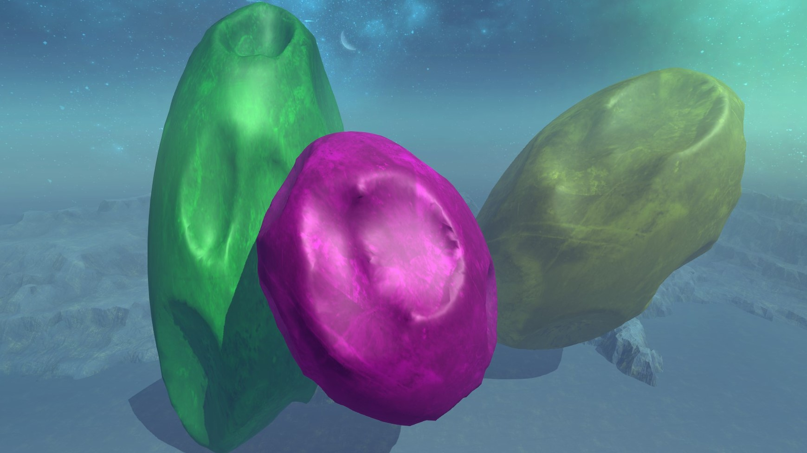
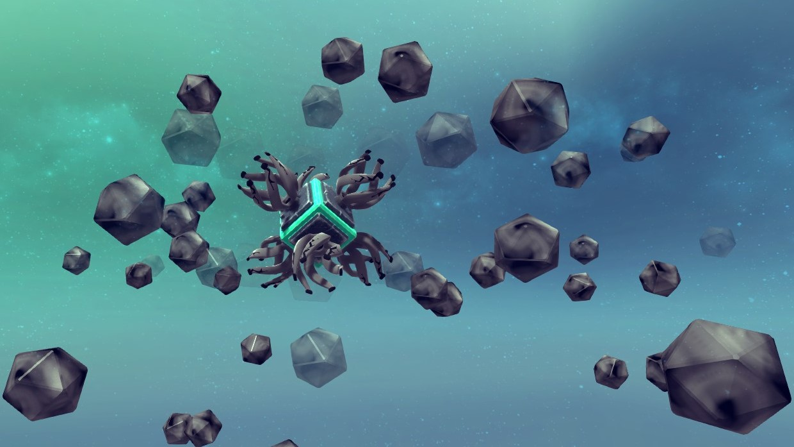
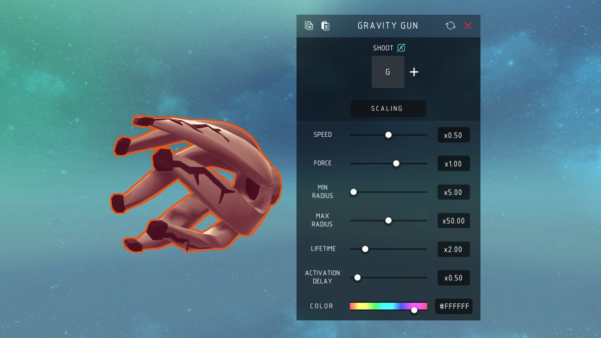
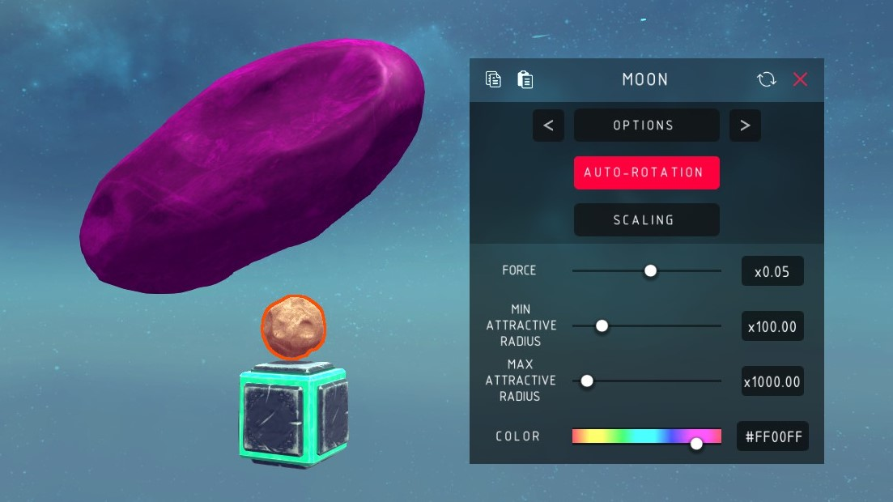

# Besiege Moon

Moons and gravity guns, in [Besiege](https://store.steampowered.com/app/346010/Besiege/).



Two blocks that bend gravity. Everything in the level feels them, not just your
machine: the enemy, the scenery, arrows, debris, and other people's machines in
multiplayer.

## Install

Either subscribe to the mod on Steam, or if you don't use Steam you can clone the repo then:

```sh
./tools/install.sh              # symlink into Besiege_Data/Mods
./tools/install.sh --copy       # copy instead
./tools/install.sh --uninstall
```

Set `BESIEGE_DIR` if your install isn't found automatically. Start Besiege, enable **Moon** in the mods menu, and enter a level or the sandbox. No C# toolchain is needed, the build uses Besiege's own compiler.

## Gravity Gun



Aim it, press the key, and it fires a sphere. The sphere fades in, pulls everything near it for its lifetime, then fades out and vanishes. Fire as many as you like.



| Setting | What it does |
| --- | --- |
| Shoot | Key that fires. Default `G` |
| Speed | How fast the sphere is launched |
| Force | Pull strength. **Negative pushes** |
| Min radius | Inside this the pull is flat, so nothing gets flung |
| Max radius | Outside this the sphere does nothing |
| Lifetime | How long it lasts once active |
| Activation delay | Fade-in, during which it pulls nothing. Long enough to get the shot clear of your own machine |
| Color | Colour of the sphere |

## Moon



A planet placed somewhere in the level. The block disappears when you start simulating and only the moon is left, so you can orbit it, land on it, or crash into it.

| Setting | What it does |
| --- | --- |
| Auto-rotation | Spins the moon slowly |
| Force | Pull strength. **Negative pushes** |
| Min / max attractive radius | The same two radii, at planet scale |
| Color | Colour of the moon |
| Position / Rotation / Scale | Nine sliders, one group at a time, picked with `<` `>` at the top |

Between the two radii the pull falls off smoothly to nothing, so the edge of a field is not a cliff.

## Atmosphere

Off by default. Turn it on and gravity, air drag and the ambient light all thin out with altitude in four steps: full at ground level, gone above the ceiling. Fly high enough and you are in vacuum and darkness. Everything it changes is put back when you stop simulating.

Set from the in-game console:

| Command | Effect |
| --- | --- |
| `atmosphere true` / `false` | Turn it on or off |
| `minAltitude <n>` | Where the air starts to thin. Default 750 |
| `maxAltitude <n>` | Where gravity reaches zero. Default 1000 |

## Notes

The C# for this mod was lost and has been recovered from the shipped 2018 assembly. [docs/RECOVERY.md](docs/RECOVERY.md) is the record of how, and how far the result can be trusted. [CHANGELOG.md](CHANGELOG.md) lists what was broken in that build and has since been fixed.

Details land in `Player.log` and in the in-game console with `show_logs true`.

AI agent? see [AGENTS.md](AGENTS.md) for layout, build, and any relevant info.
[docs/MODDING-NOTES.md](docs/MODDING-NOTES.md) has some info on Besiege's modding API.
